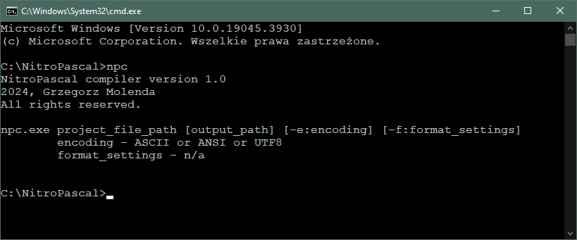
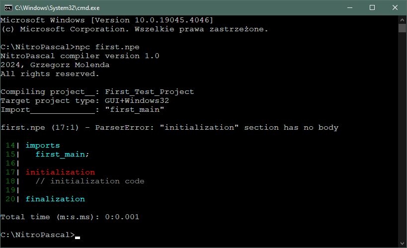

# 
NitroPascal is a concept of new OOP programming language based on Pascal / Delphi.  



The goal is to make this lannguage the best Pascal version there is.  
Because we believe that a programing language is only as good as the experience of writing it.  
To eliminate annoying bariers and old habits.  
To give programmers the freedom to create without doubling down on old schemas.  
And produce blazingly fast compiler with in memory compile and execution feature.  

Maybe in the future there will be a compiler and debugger.  

---

## About compiler

>> 2024-02-10  
This is "work in progress" type repo for the time being.  
All projects are made using Delphi 10.2.3.  
Project uses madExcept to track bugs and memory leaks.  
For now there is no other external dependencies - but this can change at any time.  
  
  
A typical compiler consists of key components such as:  
- lexical analyser (TNPCLexer and TNPCTexer),  
- syntax analyser (TNPCSourceParser),  
- semantic analyser (TNPCASTGenerator),  
- intermediate code generator (TNPCINTGenerator),  
- code optimiser (TNPCOptimization),  
- code generator (TNPCBITGenerator).  
  
  
Stages complited/under development:  
|?| - lexical analyser (TNPCLexer and TNPCTexer),  
|?| - syntax analyser (TNPCSourceParser),  
      -- control flow statements comleted/under development:  
      |x| - if statement,  
      |?| - case statement,  
      | | - for statement,  
      | | - while statement,  
      | | - repeat statement,  
      | | - with statement,  
| | - semantic analyser (TNPCASTGenerator),  
| | - intermediate code generator (TNPCINTGenerator),  
| | - code optimiser (TNPCOptimization),  
| | - code generator (TNPCBITGenerator).  
  
----------------------------------------------------------------------  
|x| - done  
|?| - under development  
| | - not developed yet  
  
  

---

### Project files (extension: '.npe'):

```Pascal
project 'Project name';

// all project parameters and declarations, switches, compiler output instructions or directives  
// goes right in this file.
// we don't need project configuration files separated from the project itself.
//  
// program-type directive defines what type of compilation should be done:  
//   - GUI     - means program that uses operating system Graphic User Interface like in eg.: Windows,  
//   - CONSOLE - means program that outputs to the operating system console (if available),  
//   - DLL     - dynamically loaded library  
// extension will be given to output of compiler, eg.:  
//   if +Windows(32/64) is defined than extension will be '.exe' or '.dll'  
//   if +Linux(32/64) is defined than extension will be '.elf' or '.so'  
//   if +Android(32/64) is defined than extension will be '.apk'  
// custom extension can be set by declaring {$extension '.ext'}  
{$program-type GUI+Windows32}  

{$resources 'Name for resources section'  
  {@import 'resources-file-name.rc'}  
  {@define 'resource-name' type:data-type:optional-mapping-type:'resurce text or file'}  
  {@define 'resource-name' type:string:'resurce text'}  
  {@define 'resource-name' type:string:base64:'base64data'}  
}  

// this section defines the list of files that must be imported and linked into the output binary  
// in order to successfully compile the project  
imports  
  list-of-source-code-files;  

// if it is a dynamically loaded library type project, specify which source files declare exported code  
// every file of this list must contain export directive, otherwise the compiler returns an error  
exports  
  list-of-source-code-files;  

initialization  
  // initialization code  

finalization  
  // finalization code  

begin  
  // program initialization code  
end.
```

### Source code files (extension: '.npc'):

```Pascal
code 'Source_code_name';

{$defines 'Name for defines section'
  {@condition 'Name for condition' = 'Value for condition'}
  {@if 'compiler_version' == '1.0'
    {@define 'define-name' type:string = 'define value'}
  } else {
    {@define 'define-name' type:string = 'define value'}
  }
}

import
  list-of-source-code-files;

[@global:]type
  [@global:]TSomeType = predefined-type; 
  [@global:]TSomeType = class('Ancestor class name');
  // if there is no '@global:' prefix defined, than the scope of this type is local for the source code file;
  TSomeType = predefined-type; 

[@global:]const
  // consts are protected (read only) and can not be modified at any time
  [@global:]SomeConst:type = value;
  SomeConst = value;

[@global:]var
  // variables are read/write and can be modified at any time
  [@global:]SomeVariable:type = value;
  SomeVariable = value;
  
// some examples of string variable declarations
var
  ExampleString1: String = 'One line test string';  
  ExampleString2: String = 'One line test string with "text in double quotes".';  
  ExampleString3: String = 'One line test string with \' inside. This example shows that you can escape some characters.';  
  ExampleString4: String = 'One line test string with\rmultiple lines of text in it, braked by return escape.';  

  ExampleString5: String = 'Multi-line test string.  
                            This and every other line must start exactly where first line starts.  
                            To end this string, put \' character where first \' was.  
                           ';  
  ExampleString6: String = '  Multi-line test string.  
                              This shows that text can be indented.
                              This and every other line must start exactly where first line starts.  
                              To end this string, put \' character where first \' was.  
                           ';  
  ExampleString7: String = '  
Multi-line test string.  
This shows that text can be written like this.  
This and every other line must start exactly where first line starts.  
To end this string, put \' character where first \' was.  
';  

  ExampleString8: String = '  
    Multi-line test string.  
    This shows that text can be indented and last \' specifies beginning of line and where text ends in the same time.  
    This and every other line must start exactly where first line starts.  
    To end this string, put \' character where first \' was.  
  ';  

  ExampleString9: String = 
  '  
      Multi-line test string.  
      This shows that text can be indented with n-th indent and first \' specifies beginning of line and  
      last \' must match the beginning of line indicating text end.  
      This and every other line must start exactly where first line starts.  
      To end this string, put \' character where first \' was.  
  ';  

initialization
  // initialization code

finalization
  // finalization code

end.
```

### Language rules:

1. All source code files are local scope oriented, it means that everything that is defined in source code file is containd in its scope.
2. Any type, const, variable or procedure/function defined can be set to be included in global scope, which means that it can be accessed by other source code files.
3. There is no need for existance of interface and implementation sections as in traditional Pascal.
4. Source code file is implicitly treated as implementation section, that defines what can be interfaced by declaring specifier prefix '@global:'.
5. Type definition can be extended.
6. 'begin' and 'end' key-words for method body declaration are history, for speed of typing we use brackets '{', '}' with ';' for declaration termination sign.
7. 'begin' is only allowed in project body definition, 'end.' is required as project body or source code file termination.
8. Body of methods defined in type declaration can be:
   a) declared inline with method declaration, eg.:
```Pascal
type
  TExampleType = class {
  public
    MyExample(const A, B: Int32): Int32 {
      Result := A + B;
    };
  };
```
   b) declared later in the body of source code file, eg.:
```Pascal
type
  TExampleType = class {
  public
    MyExample(const A, B: Int32): Int32;
  };

  TSecondExampleType = class(TExampleType) {
  public
    MyOtherExample: String;
  };
  ...
   
TExampleType.MyExample(const A, B: Int32): Int32 {
  Result := A + B;
};

TSecondExampleType.MyOtherExample: String {
  Result := 'output value';
};
```
9. Class or record methods can be defined as class methods by using prefix '@class:', eg.:
```Pascal
type
  TExampleType = class {
  public
    @class:MyExample(const A, B: Int32): Int32;
  };
```
10. Class or record methods can be defined as inline methods by using prefix '@inline:', eg.:
```Pascal
type
  TExampleType = class {
  public
    @inline:MyExample(const A, B: Int32): Int32;
  };
```
11. Prefixes can be concatenated together like: @global:@inline:@class:.
12. Const and variable declarations inside method body can be inlined.
13. Access to globally declared types, consts, variables require using prefix '@global:'.
14. If type, const, variable section defines many globally accessible definitions, prefix '@global:' can be added to such section definition, eg: @global:type. But any other section key-word use without such prefix sets the scope back to local.
15. All project and source code files are case-sensitive, meaning that variable 'a' and 'A' are two different declarations.
16. Some names can have spaces it them, to declare that use quotes, eg.: 'name with spaces'.
17. Numbers can be declared with '_' for better readability, eg: 1_000_000.
18. Procedures/functions are defined without differentiating key-words like in traditional Pascal.

### Procedure/function declaration and implementation rules:

1. Procedure/function declaration contains procedure/function name, set of parameters enclosed by '(' and ')', eventual result with type, eg.:
```Pascal
MyProcedure(const Param1: Int32, const Param2: Int16, const Param3: Boolean, const Param4: String);
MyFunction(const A, B: UInt16): Int32;
```
2. Function declaration can return multiple named results, by declaring them as implicit record, eg.:
```Pascal
MyFunction(const A, B: UInt16, const C: String): (OK: Boolean, Value: String) {
  Result.OK := True;
  Result.Value := C + ' = ' + IntToStr(A) + ', ' + IntToStr(B);
};
```
3. Const and variable declarations inside of body of procedure/function implementation, can be:
   a) like in traditional Pascal, declaration on top of procedure/function body:
```Pascal
MyExample(var C: String) {
  // on top const/var declaration
  const i_max: Int32 = 123_456_789;
  var i: Int32;
  // procedure/function instructions
  C:='';
  for i :=0 to i_max - 1 {
    C:=C + IntToStr(i) + ' ';
  }
};
```
   b) can be inlined with declaration of instructions to do:
```Pascal
MyExample(var C: String) {
  // on top const declaration
  const i_max: Int32 = 123_456_789;
  // procedure/function instructions with inlined var declaration
  C:='';
  for var i: Int32 := 0 to i_max - 1 {
    C:=C + IntToStr(i) + ' ';
  }
};
```
